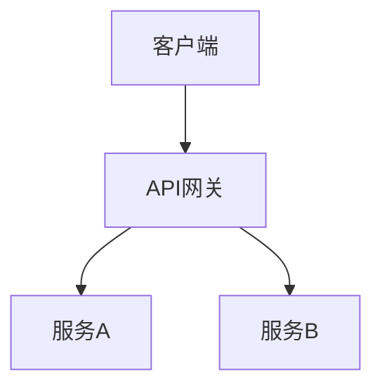
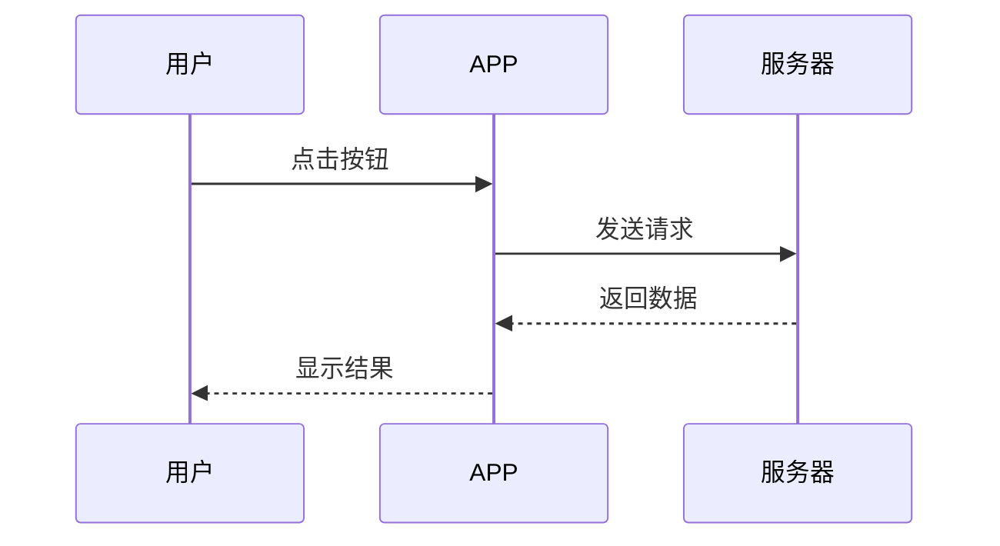

# mermaid-to-png

[](https://opensource.org/licenses/MIT)
[](https://www.python.org/downloads/)

将 Markdown 文件中的 Mermaid 图表转换为 PNG 图片，适用于微信公众号、博客、技术文档等场景。

## 功能特性

- 🚀 自动提取 Markdown 中的 Mermaid 代码块
- 🎨 支持自定义图片宽度、背景色、格式（PNG/SVG）
- 📝 可选替换原文中的 Mermaid 代码为图片引用
- 📦 批量处理多个图表
- 🔧 针对微信公众号优化（推荐宽度 900px）

## 安装

### 前置依赖

1. **安装 Node.js 和 npm**

   从 [Node.js 官网](https://nodejs.org/) 下载安装 LTS 版本。

2. **安装 mermaid-cli**

   ```bash
   npm install -g @mermaid-js/mermaid-cli
   ```

3. **安装 Python 3.8+**

   从 [Python 官网](https://www.python.org/downloads/) 下载安装。

### 安装本工具

```bash
# 克隆仓库
git clone https://github.com/yourusername/mermaid-to-png.git
cd mermaid-to-png

# 安装依赖（如果需要）
pip install -r requirements.txt
```

## 使用方法

### 基本用法

```bash
# 转换单个 Markdown 文件
python scripts/convert.py /path/to/your/article.md

# 指定输出目录
python scripts/convert.py article.md --output-dir ./images

# 自定义图片宽度（微信公众号推荐 900px）
python scripts/convert.py article.md --width 900

# 生成 SVG 格式
python scripts/convert.py article.md --format svg

# 同时替换原文中的 Mermaid 代码为图片引用
python scripts/convert.py article.md --replace
```

### 作为 Claude Skill 使用

如果你使用 Claude Code，可以将此技能添加到 Claude：

```bash
# 技能已经安装在 ~/.claude/skills/mermaid-to-png/
# 直接在 Claude 中使用：

claude mermaid-to-png /path/to/article.md --width 900 --replace
```

### 参数说明

| 参数 | 说明 | 默认值 |
|------|------|--------|
| `input` | 输入的 Markdown 文件路径 | 必填 |
| `--output-dir` | 图片输出目录 | `./output` |
| `--width` | 图片宽度（像素） | `1200` |
| `--background` | 背景色（white/transparent/#RRGGBB） | `white` |
| `--format` | 输出格式（png/svg） | `png` |
| `--replace` | 替换原文中的 Mermaid 代码为图片引用 | `false` |

## 示例

### 输入文件（article.md）

```markdown
# 系统架构

## 整体架构



## 数据流


```

### 转换命令

```bash
python scripts/convert.py article.md --width 900 --output-dir ./images --replace
```

### 输出

```
images/
├── diagram_1_a3f7d2e1.png
├── diagram_2_b8c9a4f3.png
└── article_converted.md
```

转换后的 `article_converted.md`：

```markdown
# 系统架构

## 整体架构


## 数据流


```

## 常见问题

### 1. 转换失败，提示 `mermaid-cli not found`

**原因**：没有安装 mermaid-cli。

**解决**：
```bash
npm install -g @mermaid-js/mermaid-cli
```

### 2. 生成的图片中文显示为方框

**原因**：系统缺少中文字体。

**解决**：
- **macOS**: 安装字体 `brew install --cask font-noto-sans-cjk`
- **Linux**: 安装中文字体 `sudo apt-get install fonts-noto-cjk`

### 3. 微信公众号图片上传失败

**原因**：图片尺寸或格式不符合要求。

**解决**：
- 使用 `--width 900` 参数（微信公众号推荐宽度）
- 确保使用 `--format png`（微信公众号支持 PNG）
- 图片大小不超过 10MB

## 贡献

欢迎提交 Issue 和 Pull Request！

## 许可证

MIT License
