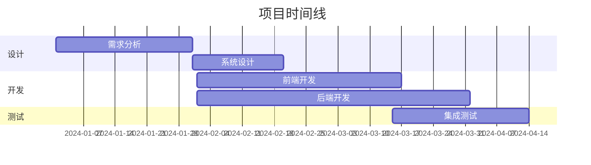

# Gantt Chart Example

```mermaid
gantt
    title 项目时间线
    dateFormat  YYYY-MM-DD
    section 设计
    需求分析 :a1, 2024-01-01, 30d
    系统设计 :a2, after a1, 20d
    section 开发
    前端开发 :b1, 2024-02-01, 45d
    后端开发 :b2, 2024-02-01, 60d
    section 测试
    集成测试 :c1, 2024-03-15, 30d
```
