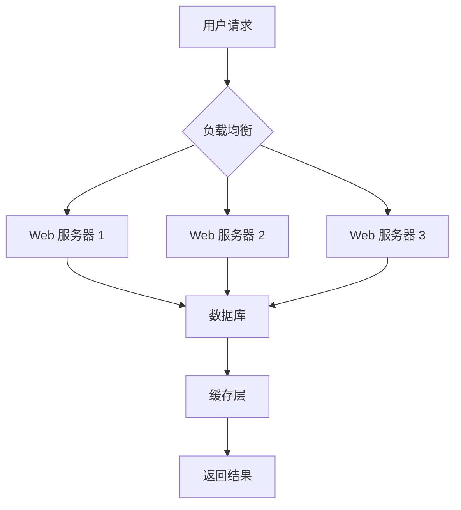
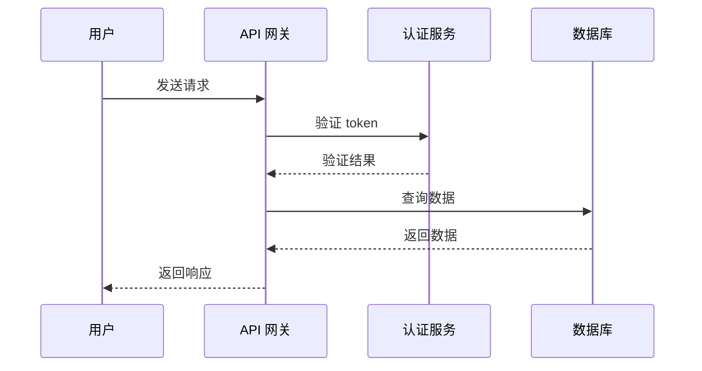

# 示例文章：系统架构设计

## 概述

本文档描述了系统的整体架构设计。

## 系统流程图

```mermaid
graph TD
    A[用户请求] --> B{负载均衡}
    B --> C[Web 服务器 1]
    B --> D[Web 服务器 2]
    B --> E[Web 服务器 3]
    C --> F[数据库]
    D --> F
    E --> F
    F --> G[缓存层]
    G --> H[返回结果]
```

## 数据流向

```mermaid
sequenceDiagram
    participant User as 用户
    participant API as API 网关
    participant Auth as 认证服务
    participant DB as 数据库

    User->>API: 发送请求
    API->>Auth: 验证 token
    Auth-->>API: 验证结果
    API->>DB: 查询数据
    DB-->>API: 返回数据
    API-->>User: 返回响应
```

## 总结

以上是系统的核心架构设计。
