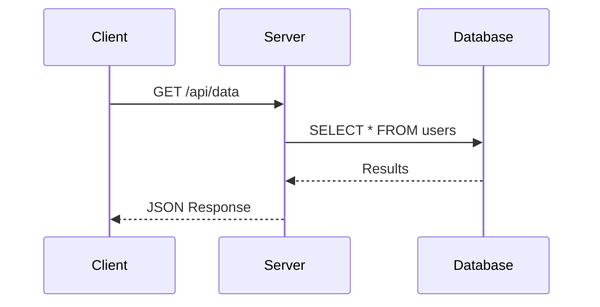

# Sequence Diagram Example

```mermaid
sequenceDiagram
    participant C as Client
    participant S as Server
    participant D as Database

    C->>S: GET /api/data
    S->>D: SELECT * FROM users
    D-->>S: Results
    S-->>C: JSON Response
```
